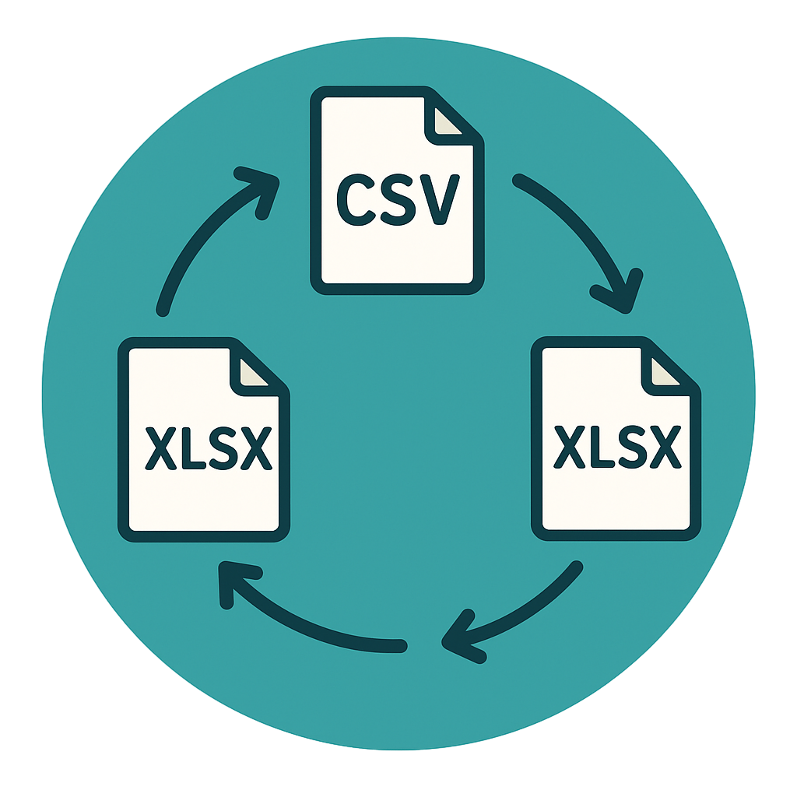

# 🔄 FormatSwitch

<p align="center">
  
</p>

**Universal File Converter**
Lightweight Python tool for converting data between CSV, JSON and Excel formats.
Designed for **developers and analysts** who need quick setup, minimal config, and ease of use.

<p align="center">
  
 
 
  
</p>

---

## 🚀 Overview

FormatSwitch allows you to:

- ⚡ Convert files between CSV, JSON, XLSX, XLS formats  
- 🧩 Use both CLI and GUI interfaces  
- 📦 Install via various package managers  
- 🤖 Automatically detect encoding and file structure  

Perfect for **developers, data analysts, or users** who frequently need to convert data between different formats.

---

## ✨ Features

- Support for all major data formats (CSV, JSON, Excel)
- GUI with dark theme
- CLI application for automation tasks
- Automatic file encoding detection
- Support for multi-sheet Excel files
- Cross-platform compatibility (Windows, Linux, macOS)
- Installation via installers and package managers

---

## 📦 Installation

```bash
git clone https://github.com/lovlygod/FormatSwitch.git
cd FormatSwitch
pip install -r requirements.txt
```

## ⚙️ Configuration Example

For CLI application:

```bash
# Convert CSV to JSON
python format_converter.py data.csv data.json

# Convert JSON to Excel
python format_converter.py data.json data.xlsx

# Convert Excel with sheet specification
python format_converter.py data.xlsx data.json --sheet "Sheet1"
```

For GUI application:

```bash
python gui_converter.py
```

---

## 🚀 Quick Start

```python
from format_converter import csv_to_json

csv_to_json("input.csv", "output.json")
```

- Runs conversion from CSV to JSON
- Automatically detects encoding
- Saves result to specified file

---

## 📁 Project Structure

```bash
FormatSwitch/
 ├── format_converter.py     # Core conversion module
 ├── gui_converter.py        # Graphical interface
 ├── create_installer.py     # Windows installer creation
 ├── create_linux_package.py # Linux package creation
 ├── requirements.txt        # Dependencies
 └── README.md               # Documentation
```

---

## 🗺️ Roadmap

- Add support for other formats (XML, YAML)
- Enhanced error handling
- Batch file processing
- Integration with cloud storage
- Support for custom formats

---

## 🤝 Contributing

FormatSwitch is built for developers and users who value simplicity in data work.

- Open issues for bugs or suggestions
- Submit pull requests
- Share ideas in discussions

---

## 📊 Stats

<p align="center">
  
  
</p>

<p align="center">
  <sub>FormatSwitch — fast, convenient and simple tool for data processing. Made with ❤️ by [@lovlyswag](https://t.me/lovlyswag)</sub>
</p>